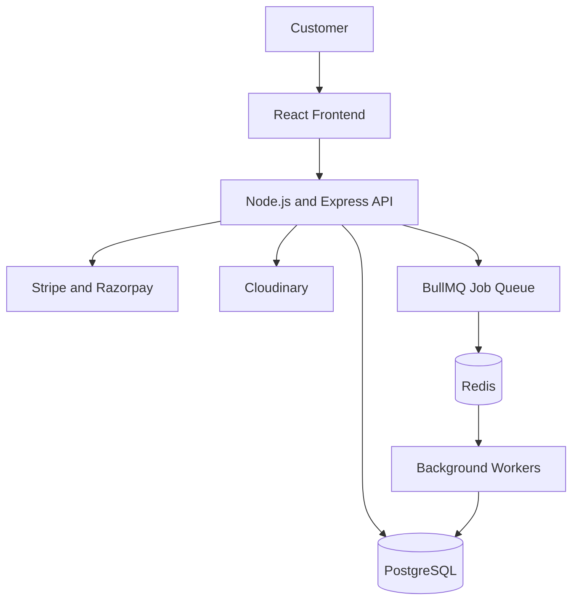

# ⚽ Legacy XI 2.0 — Beyond CRUD

### A Full-Stack Football Jersey E-Commerce Platform

Legacy XI 2.0 is a full-stack e-commerce platform for football jersey enthusiasts, designed to deliver a smooth shopping experience while exploring practical backend engineering challenges.

Beyond basic CRUD operations, the project focuses on inventory management, concurrent purchase handling, payment webhook idempotency, asynchronous job processing, retry strategies, and reservation expiration.

<p align="center">
  <a href="https://legacy-xi-2-0-psi.vercel.app/">🌐 Live Demo</a> •
  <a href="https://github.com/Omkar-XD/legacy-XI-2.0">💻 GitHub Repository</a>
</p>

---

## 📋 Table of Contents

- [Features](#-features)
- [Backend Engineering Concepts](#-backend-engineering-concepts)
- [System Architecture](#-system-architecture)
- [Technology Stack](#-technology-stack)
- [Core Workflows](#-core-workflows)
- [Project Structure](#-project-structure)
- [Installation and Setup](#-installation-and-setup)
- [Deployment](#-deployment)
- [Architectural Trade-Offs](#-architectural-trade-offs)
- [Future Improvements](#-future-improvements)
- [Contributing](#-contributing)
- [Author](#-author)

---

## ✨ Features

### 🛍️ E-Commerce Experience

- Browse football jerseys and explore product details.
- Search, filter, and navigate the product catalog.
- Manage shopping cart items and checkout workflows.
- Responsive shopping experience for desktop and mobile users.

### 💳 Payment Integration

- Stripe and Razorpay payment integrations.
- Payment webhook handling for asynchronous payment events.
- Backend processing of payment status updates.
- Persisted webhook event tracking for duplicate-event handling.

### 📦 Inventory and Reservation Management

- Product inventory and order-related reservation management.
- Database concurrency controls where implemented.
- Reservation expiration and pending-order cleanup.
- Inventory consistency during checkout workflows.

### ⚡ Asynchronous Background Processing

- Redis and BullMQ for background job processing.
- Separation of suitable background tasks from synchronous HTTP requests.
- Configurable retries and backoff strategies.
- Background processing for payment events and reservation maintenance.

### 🖼️ Media and Deployment

- Cloudinary for product media management.
- PostgreSQL for relational data persistence.
- Vercel for frontend hosting.
- Render for backend hosting.

---

## ⚙️ Backend Engineering Concepts

### 1. Inventory Concurrency Control

When multiple customers attempt to purchase the same limited-stock product, concurrent requests can cause incorrect inventory updates if stock is modified without appropriate protection.

The backend uses database-level consistency mechanisms where implemented to help protect inventory and order workflows.

**Engineering goal:** Prevent overselling and preserve inventory consistency under concurrent requests.

### 2. Payment Webhook Idempotency

Payment providers may deliver the same webhook more than once. Processing duplicate events without protection can result in repeated business operations.

The project uses persisted webhook event records and processing status tracking as part of its idempotency workflow.

**Engineering goal:** Avoid repeating the same payment-related operation when an event is delivered multiple times.

> End-to-end idempotency depends on atomic event claiming, appropriate database constraints, and safe business-operation handling. Verify these guarantees with implementation review and concurrent tests.

### 3. Asynchronous Job Processing

Some tasks do not need to finish during the customer's HTTP request. Background queues allow eligible work to be processed separately.

BullMQ uses Redis to manage jobs and coordinate background processing.

**Engineering goal:** Separate suitable background work from request handling and improve resilience to transient failures.

### 4. Retry and Backoff Strategies

Transient failures can occur when interacting with external services or processing queued jobs.

Configurable retries and exponential backoff can reduce repeated attempts and give temporary failures time to recover.

**Engineering goal:** Improve recovery from transient errors while avoiding uncontrolled retry loops.

### 5. Reservation Expiration and Recovery

Reservations can become stale when checkout is abandoned or payment does not complete within the allowed period.

A scheduled background process can identify expired reservations and perform the appropriate cleanup or order-state transitions.

**Engineering goal:** Recover inventory safely and prevent abandoned reservations from remaining active indefinitely.

### 6. Database Consistency and Failure Handling

Payment processing, order updates, inventory changes, and reservation cleanup may interact with one another.

These workflows require careful transaction boundaries, consistent lock ordering, failure recovery, and duplicate-event protection.

**Engineering goal:** Keep related business records consistent even when requests overlap or background jobs fail.

---

## 🏗️ System Architecture

The platform follows a frontend-backend architecture with a relational database, external payment services, media storage, and background processing infrastructure.



### Architecture Components

| Component | Responsibility |
|---|---|
| React frontend | Product browsing, cart, checkout, and user interface |
| Node.js and Express | API endpoints and backend business logic |
| PostgreSQL | Persistent relational data |
| Redis | Queue infrastructure for BullMQ |
| BullMQ workers | Asynchronous job processing |
| Stripe and Razorpay | Payment processing and payment events |
| Cloudinary | Product image and media management |
| Vercel and Render | Frontend and backend hosting |

*This diagram represents the high-level architecture. Actual request flows and deployed integrations depend on the implementation and environment configuration.*

---

## 🛠️ Technology Stack

### Frontend

- **React** — Component-based user interface.
- **Tailwind CSS** — Utility-first styling.
- **shadcn/ui** — Reusable interface components.
- **JavaScript / TypeScript** — Use the languages present in the frontend codebase.

### Backend

- **Node.js** — JavaScript runtime.
- **Express.js** — HTTP routing and middleware.
- **BullMQ** — Background job queue management.
- **Redis** — Queue storage and coordination.

### Database and Integrations

- **PostgreSQL** — Relational database.
- **Stripe** — Payment integration.
- **Razorpay** — Payment integration.
- **Cloudinary** — Media storage and delivery.

### Deployment

- **Vercel** — Frontend hosting.
- **Render** — Backend hosting.

---

## 🔄 Core Workflows

### Customer Purchase Workflow

1. The customer browses available football jerseys.
2. The customer selects a product and proceeds to checkout.
3. The backend validates the order and relevant inventory state.
4. The payment provider processes the payment.
5. The backend receives and processes the relevant payment event.
6. Order and inventory states are updated according to the implemented workflow.
7. Eligible background jobs handle asynchronous tasks.

### Payment Webhook Workflow

1. A payment provider sends a webhook to the backend.
2. The backend validates the webhook according to provider requirements.
3. The event is recorded for processing.
4. The event is queued or processed through the configured workflow.
5. The worker performs the required business operations.
6. Processing status is updated to support recovery and duplicate-event handling.

### Reservation Expiration Workflow

1. A reservation is created as part of the checkout workflow.
2. The reservation remains active for its configured lifetime.
3. A background process identifies expired reservations.
4. The backend checks the associated order and payment state.
5. Eligible reservations are cleaned up and inventory is handled according to the implemented rules.

---

## 📁 Project Structure

The following is a representative structure. Update it to match the exact folders and files in your repository.

```text
legacy-XI-2.0/
├── frontend/
│   ├── src/
│   │   ├── components/
│   │   ├── pages/
│   │   ├── hooks/
│   │   ├── services/
│   │   └── ...
│   ├── package.json
│   └── ...
│
├── backend/
│   ├── src/
│   │   ├── db/
│   │   ├── modules/
│   │   ├── workers/
│   │   └── ...
│   ├── package.json
│   └── ...
│
└── README.md
```

---

## 🚀 Installation and Setup

### Prerequisites

- [Node.js](https://nodejs.org/)
- npm
- [Git](https://git-scm.com/)
- PostgreSQL
- Redis, if required by the configured background processing workflows

### Step 1: Clone the Repository

```bash
git clone https://github.com/Omkar-XD/legacy-XI-2.0.git
cd legacy-XI-2.0
```

### Step 2: Install Dependencies

Install frontend dependencies:

```bash
cd frontend
npm install
```

Install backend dependencies:

```bash
cd ../backend
npm install
```

### Step 3: Configure Environment Variables

Create the appropriate environment files using the variable names expected by the application.

The following is an illustrative example:

```env
# Database
DATABASE_URL=

# Redis
REDIS_URL=

# Authentication
JWT_SECRET=

# Stripe
STRIPE_SECRET_KEY=
STRIPE_WEBHOOK_SECRET=

# Razorpay
RAZORPAY_KEY_ID=
RAZORPAY_KEY_SECRET=
RAZORPAY_WEBHOOK_SECRET=

# Cloudinary
CLOUDINARY_CLOUD_NAME=
CLOUDINARY_API_KEY=
CLOUDINARY_API_SECRET=
```

**Important:** Verify the exact variable names in the backend configuration and `.env.example` files. Never commit real credentials or secret keys to GitHub.

### Step 4: Start the Application

Start the backend using the development script defined in its `package.json`:

```bash
cd backend
npm run dev
```

In another terminal, start the frontend using its configured development script:

```bash
cd frontend
npm run dev
```

If either project uses a different script name, use the corresponding command from that directory's `package.json`.

Open the local frontend URL printed in the terminal.

---

## ☁️ Deployment

- **Frontend:** [Legacy XI 2.0](https://legacy-xi-2-0-psi.vercel.app/)
- **Backend:** [Legacy XI Backend](https://legacy-xi-backend.onrender.com/)
- **GitHub Repository:** [Omkar-XD/legacy-XI-2.0](https://github.com/Omkar-XD/legacy-XI-2.0)

The frontend and backend are deployed separately. Successful operation depends on correct environment variables, database connectivity, payment-provider configuration, and background worker setup.

---

## ⚖️ Architectural Trade-Offs

### 1. Relational Database vs. In-Memory State

PostgreSQL provides durable relational storage and transactional capabilities for orders, inventory, and payment-related records. It requires appropriate indexing, transaction design, and query optimization as the application grows.

### 2. Synchronous Requests vs. Background Jobs

Synchronous processing can be simpler for immediate customer-facing operations. Background queues are useful for eligible work that can be processed asynchronously, but introduce additional requirements such as retries, job monitoring, and duplicate-processing protection.

### 3. Reliability vs. Operational Complexity

Payment events, reservation expiration, and inventory updates require robust recovery mechanisms. Queues and workers provide additional recovery options but also introduce more components to test and maintain.

### 4. External Payment Providers

Integrating payment services avoids implementing payment processing from scratch. However, webhooks can be delayed, duplicated, or delivered out of order, so the backend must validate events and handle state transitions carefully.

---

## 🔮 Future Improvements

- Add automated concurrency tests for competing purchases.
- Test duplicate and out-of-order payment webhooks.
- Strengthen atomic idempotency using appropriate database constraints and transaction boundaries.
- Standardize database lock ordering across payment and reservation workflows.
- Add queue monitoring, structured logs, and actionable failure alerts.
- Introduce integration tests for payment-versus-expiration races.
- Improve API rate limiting, validation, and security testing.
- Add performance benchmarks for high-concurrency checkout scenarios.
- Improve automated deployment checks and production readiness monitoring.

These are potential improvements, not claims that the corresponding functionality is already complete.

---

## 🤝 Contributing

Contributions and suggestions are welcome.

1. Fork the repository.
2. Create a feature branch:

   ```bash
   git checkout -b feature/your-feature
   ```

3. Commit your changes:

   ```bash
   git commit -m "feat: describe your change"
   ```

4. Push your branch:

   ```bash
   git push origin feature/your-feature
   ```

5. Open a Pull Request.

---

## 👨‍💻 Author

**Omkar Chavan**

- GitHub: [@Omkar-XD](https://github.com/Omkar-XD)
- Project: [Legacy XI 2.0](https://github.com/Omkar-XD/legacy-XI-2.0)

---

<p align="center">
  Built with ⚽ and a focus on reliable backend engineering.
</p>
