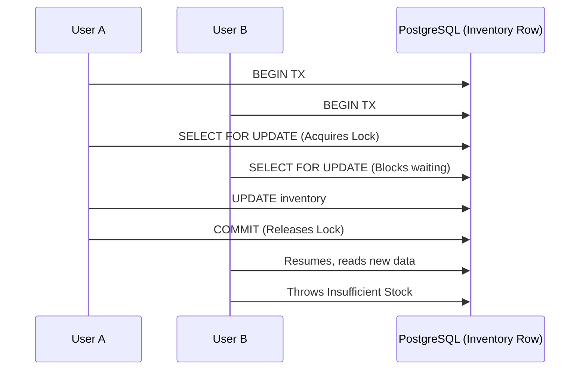

# Engineering Concepts in Legacy XI

This document explains the top 5 verified engineering concepts implemented in the Legacy XI backend that differentiate it from a basic CRUD application.

---

## 1. Pessimistic Concurrency Control (Row-Level Locking)

### A. Concept name
Pessimistic Concurrency Control / Row-Level Locking (`SELECT ... FOR UPDATE`)

### B. The real problem
In a highly concurrent e-commerce environment, two customers might attempt to checkout with the last remaining Barcelona jersey at the exact same millisecond. If the system reads the inventory (`available_quantity = 1`) and updates it (`available_quantity = 0`) without protection, both requests might see `1`, proceed to checkout, and deduct the inventory, resulting in `available_quantity = -1`. The business oversells a product it cannot fulfill.

### C. Why a basic implementation is insufficient
A naive implementation does this:
1. `SELECT available_quantity FROM inventory WHERE variant_id = 'X'`
2. `if (available >= requested) { UPDATE inventory SET available_quantity = available - requested }`
In concurrent requests, Step 1 happens for both users before Step 2 executes for either, causing a race condition.

### D. Why this architecture was selected
Legacy XI uses **Pessimistic Locking** (`SELECT ... FOR UPDATE`) at the database level. Instead of risking a race condition or failing frequently (Optimistic Locking), pessimistic locking forces concurrent requests for the exact same row to queue up and execute sequentially. It guarantees 100% inventory accuracy with a very straightforward developer mental model.

### E. Algorithm or mechanism
Database Mechanism: **Row-Level Locking** via PostgreSQL's `FOR UPDATE` clause.

### F. Exact implementation in Legacy XI
- **File path:** `src/modules/checkout/checkout.routes.js`
- **Relevant code excerpt:**
  ```javascript
  const [inv] = await tx.select()
    .from(inventory)
    .where(eq(inventory.variant_id, item.variant_id))
    .for('update');
  
  if (inv.available_quantity < item.quantity) throw new Error('Insufficient stock');
  ```
- **Call chain:** Frontend Checkout Button -> `POST /api/checkout/` -> Transaction Context -> `FOR UPDATE` query.

### G. Execution walkthrough
1. User A and User B request checkout for the same variant concurrently.
2. User A's transaction reaches `SELECT ... FOR UPDATE` and acquires an exclusive write lock on the inventory row.
3. User B's transaction reaches `SELECT ... FOR UPDATE` and is suspended by PostgreSQL (blocks) waiting for User A's lock.
4. User A completes checkout, deducts inventory, and commits the transaction. The lock is released.
5. User B's transaction resumes, reads the newly updated row, sees `available_quantity = 0`, and safely throws an "Insufficient stock" error.

### H. Architecture diagram


### I. Failure scenarios and limitations
- **If the process crashes:** The PostgreSQL transaction rolls back, releasing the lock automatically.
- **Limitations:** Locking rows strictly sequentially reduces maximum throughput for a single highly contested item (e.g., a flash sale of 1 item with 10,000 buyers). 

### J. Interview explanation
**90-second answer:** "To prevent inventory overselling, I implemented Pessimistic Concurrency Control using PostgreSQL's `FOR UPDATE` mechanism. If two users check out the same jersey simultaneously, a naive read-modify-write approach causes race conditions. In my checkout route, the transaction explicitly locks the inventory rows it needs. If a concurrent request attempts to checkout the same item, the database suspends it until the first transaction commits. This completely eliminated race conditions at the database level, ensuring our inventory guarantees are mathematically sound."

### K. Follow-up interview questions
1. *Why didn't you use Optimistic Concurrency Control (Version columns)?*
   - Answer: Optimistic locking works well when collisions are rare, but during high-traffic drops, it results in many rejected checkouts that force the user to retry. Pessimistic locking handles it gracefully by queuing the transactions at the DB level.
2. *What happens if the user abandons the checkout?*
   - Answer: The transaction rolls back and the lock is released instantly. (Note: Reservations handle the 15-minute logical hold).

### L. Hands-on verification
Source-code tracing: Search for `.for('update')` in `checkout.routes.js`.

---

## 2. Deadlock Prevention via Deterministic Lock Ordering

### A. Concept name
Deadlock Prevention (Deterministic Lock Acquisition Order)

### B. The real problem
Legacy XI processes payments via a background worker and expires reservations via a sweeping cron job. Both jobs operate on the same database tables (`orders`, `reservations`, `inventory`). If the Payment Worker locks `reservations` then `orders`, while the Sweeper locks `orders` then `reservations`, they can mutually block each other forever, causing a database deadlock and stalling the entire backend.

### C. Why a basic implementation is insufficient
Developers often write queries in the order they conceptually need them. However, when complex background jobs interact with the same core tables concurrently, ad-hoc querying leads to circular waiting.

### D. Why this architecture was selected
Rather than retrying transactions indefinitely when deadlocks occur, Legacy XI prevents deadlocks architecturally by enforcing a strict hierarchy of locks across all asynchronous modules.

### E. Algorithm or mechanism
Concurrency Control Technique: **Strict Global Lock Ordering**.

### F. Exact implementation in Legacy XI
- **File path:** `src/modules/workers/reservation.sweep.js`
- **Relevant code excerpt:**
  ```javascript
  // Lock order FIRST to match payment.worker lock order and avoid deadlock
  if (candidate.order_id) {
    const [order] = await tx.select().from(orders).where(eq(orders.id, candidate.order_id)).for('update');
  }
  // Lock the reservation SECOND
  const [lockedRes] = await tx.select().from(reservations).for('update', { skipLocked: true });
  ```

### G. Execution walkthrough
1. The Payment Worker initiates a transaction and needs to process Order #1.
2. The Worker locks `payments` -> `orders` -> `reservations`.
3. Concurrently, the Sweeper detects a timeout for Order #1.
4. The Sweeper initiates a transaction and requests a lock on `orders` (Step 1 of its hierarchy).
5. The Sweeper blocks safely, waiting for the Payment Worker to finish. No circular dependency is created.

### I. Failure scenarios and limitations
- **If a new developer breaks the hierarchy:** Deadlocks will re-emerge. 
- **Limitations:** Requires strict code reviews to ensure lock ordering is maintained across all future workers.

### J. Interview explanation
**90-second answer:** "When introducing background jobs for payments and expirations, I encountered the risk of database deadlocks. If my payment worker locked reservations then orders, while the expiration sweeper locked orders then reservations, they could permanently block each other. I solved this by implementing a strict Deterministic Lock Acquisition Order. Across the entire application, transactions must lock tables in a specific hierarchy—always `payments`, then `orders`, then `reservations`, then `inventory`. This eliminates circular waiting entirely."

### K. Follow-up interview questions
1. *How did you handle locking multiple rows in the same table?*
   - Answer: In the checkout route, I sort the items by `variant_id` (`[...items].sort((a, b) => a.variant_id.localeCompare(b.variant_id))`) before locking the inventory rows, which applies the deterministic ordering principle to rows within the same table!

---

## 3. Idempotent Webhook Processing (Outbox Variant)

### A. Concept name
Idempotent Event Ingestion / Webhook Idempotency

### B. The real problem
Payment providers like Stripe and Razorpay guarantee "at-least-once" delivery of webhooks. If a network blip occurs, Stripe might send the `checkout.session.completed` event three times. If the backend processes it three times, the order state machine could break, or worse, inventory might be released or confirmed erroneously multiple times.

### C. Why a basic implementation is insufficient
A basic webhook handler directly updates the order status. If it receives a duplicate event, it blindly transitions the order again, leading to inconsistent analytics, duplicate confirmation emails, or crashing the state machine.

### D. Why this architecture was selected
Legacy XI uses a database table (`processed_webhook_events`) with a unique constraint to deduplicate events transactionally *before* business logic runs. This is vastly superior to caching deduplication in Redis, because if Redis evicts the key, a late duplicate webhook would slip through.

### E. Algorithm or mechanism
Reliability Pattern: **Idempotent Ingestion via Upsert / Unique Constraints**.

### F. Exact implementation in Legacy XI
- **File path:** `src/modules/payments/webhooks.routes.js`
- **Relevant code excerpt:**
  ```javascript
  let [record] = await db.insert(processed_webhook_events).values({
    provider: 'stripe', event_id: eventId, status: 'pending', payload: event
  }).onConflictDoNothing().returning();
  ```

### G. Execution walkthrough
1. Stripe delivers a webhook with `event_id = X`.
2. The server attempts to INSERT `X` into `processed_webhook_events`. It succeeds.
3. The event is enqueued to BullMQ and processed safely in the background.
4. Stripe delivers a duplicate webhook `event_id = X` five seconds later.
5. The server attempts to INSERT `X`. The database rejects it via `ON CONFLICT DO NOTHING`.
6. `record` is undefined. The code checks the existing status, sees it is processing/processed, and returns a 200 OK to Stripe without executing the business logic again.

### J. Interview explanation
**Implementation-level answer:** "To handle Stripe's at-least-once delivery guarantees safely, I designed an idempotent webhook ingestion pipeline. When a webhook arrives, the route immediately attempts to insert the `event_id` into a PostgreSQL table using an `ON CONFLICT DO NOTHING` constraint. The database itself enforces uniqueness. If the insert succeeds, the event is delegated to a BullMQ worker for heavy processing. If the insert fails, we know it's a duplicate, and we simply return a 200 OK to satisfy Stripe's retry mechanism without affecting our business state. This relies on the database's ACID properties to ensure bulletproof idempotency."

---

## 4. Asynchronous Queue-Based Processing

### A. Concept name
Asynchronous Background Job Processing (Message Queue)

### B. The real problem
Processing a payment success webhook is heavy: it requires verifying amounts, traversing the order state machine, updating inventory, confirming reservations, and handling potential failures. If done synchronously in the fastify HTTP handler, the request could time out, causing Stripe to incorrectly assume failure and repeatedly retry the webhook.

### C. Why a basic implementation is insufficient
Running heavy business logic inside an HTTP handler keeps the connection open. If the database is under load, the handler hangs. This violates the principle of failing fast and isolating third-party latency from core application performance.

### D. Why this architecture was selected
Legacy XI delegates heavy state transitions to BullMQ backed by Upstash Redis. The HTTP handler only does cryptographic signature verification and idempotent insertion (taking <50ms) before returning a 200 OK. The heavy database lifting is performed asynchronously.

### E. Algorithm or mechanism
Architectural Pattern: **Message Queuing / Asynchronous Workers**.

### F. Exact implementation in Legacy XI
- **File path:** `src/modules/payments/webhooks.routes.js` and `src/modules/workers/payment.worker.js`
- **Relevant code excerpt:**
  ```javascript
  // In route:
  await paymentQueue.add('process-stripe-webhook', { provider: 'stripe', eventId, payload: event });
  return reply.send({ received: true });
  
  // In worker:
  const paymentWorker = new Worker('payment-webhooks', async (job) => { /* heavy DB logic */ });
  ```

### J. Interview explanation
**90-second answer:** "I decoupled payment processing from webhook ingestion using BullMQ and Redis. When a webhook arrives, I verify the signature, ensure idempotency, and immediately drop the event into a Redis queue before returning a 200 response to Stripe. A separate Node.js worker process consumes from this queue at its own pace. This architecture isolates my API layer from database latency, guarantees Stripe receives fast acknowledgments preventing webhook timeouts, and provides automatic retries via exponential backoff if a transient database failure occurs during processing."

---

## 5. Concurrent Sweep Polling (SKIP LOCKED)

### A. Concept name
Concurrent Database Polling / `FOR UPDATE SKIP LOCKED`

### B. The real problem
Reservations expire after 15 minutes. A background script runs every minute to query the database for expired reservations and release their inventory. If two instances of the backend are running (e.g., during a deployment or scaling out), both sweepers might query the same expired reservations and attempt to process them simultaneously, causing massive database lock contention.

### C. Why a basic implementation is insufficient
A basic `SELECT ... FOR UPDATE` will cause the second sweeper to block and wait for the first sweeper to finish, wasting compute resources and creating an unnecessary bottleneck. 

### D. Why this architecture was selected
By using `SKIP LOCKED`, multiple sweeper processes can safely and efficiently distribute the cleanup work without coordinating through Redis or Zookeeper. The database handles the concurrency perfectly.

### E. Algorithm or mechanism
Database Primitive: **`FOR UPDATE SKIP LOCKED`**.

### F. Exact implementation in Legacy XI
- **File path:** `src/modules/workers/reservation.sweep.js`
- **Relevant code excerpt:**
  ```javascript
  const [lockedRes] = await tx.select().from(reservations)
    .where(and(eq(reservations.id, candidate.id), eq(reservations.status, 'RESERVED')))
    .for('update', { skipLocked: true });

  if (!lockedRes) return; // Skip if already processed by another worker
  ```

### J. Interview explanation
**Implementation-level answer:** "To handle reservation expiration efficiently across multiple backend instances, I implemented a database-backed sweeper using PostgreSQL's `FOR UPDATE SKIP LOCKED` primitive. When my cron job identifies expired reservations, it attempts to lock them. If another backend instance is already processing a specific reservation, the database simply skips over that row instead of blocking my transaction. This effectively turns a standard relational database table into a highly concurrent, lock-free task queue without requiring complex distributed locking mechanisms like Redlock."
