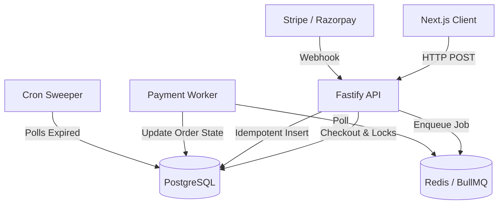

# Architecture and Design Decisions

This document provides a holistic view of the Legacy XI backend architecture, explaining why it moves beyond a simple CRUD model.

---

## 1. Architecture Overview

Legacy XI is a modern e-commerce backend designed for high concurrency and robust failure recovery.

- **Frontend:** Next.js (Vercel) handling user interaction and communicating with the API.
- **Backend API:** Fastify (Node.js) on Render, serving as the fast, low-overhead HTTP layer.
- **PostgreSQL (Supabase):** The absolute Source of Truth. It handles ACID transactions, relational integrity, and durable idempotency.
- **Redis (Upstash):** A volatile, in-memory datastore used *exclusively* for queue management, not as a primary database.
- **BullMQ:** The background job processor that reads from Redis to execute heavy, asynchronous business logic (like webhook processing).
- **Payment Providers (Stripe/Razorpay):** Third-party systems that handle actual money movement and notify the backend asynchronously via webhooks.

### Architecture Diagram

---

## 2. Why Not a Simple CRUD Architecture?

In a basic CRUD app, a checkout request directly updates the inventory in memory or a simple database, and payment success directly modifies an order row in an HTTP route. 

Legacy XI cannot use simple CRUD because:
1. **Concurrent Inventory Changes:** Flash sales cause massive contention. CRUD read-modify-write cycles lead to overselling. Legacy XI requires ACID transaction locking.
2. **Asynchronous Webhooks:** Payments are not instant. The user closes the tab, and Stripe sends a webhook 5 seconds later. We must accept this asynchronously.
3. **Duplicate Webhook Delivery:** Stripe guarantees "at-least-once" delivery. A simple CRUD app would double-count revenue or ship two jerseys if a webhook is delivered twice.
4. **Slow External Services:** If a database transaction takes 2 seconds under load, holding the HTTP connection open might cause Stripe to timeout and retry. We need background workers to fail fast on the HTTP layer.
5. **Crash Recovery:** If a simple CRUD app crashes mid-request, state is corrupted. Legacy XI uses BullMQ and Postgres transactions so that if a worker crashes, the job is retried safely.

---

## 3. Why Each Important Technology is Used

### Fastify (over Express)
- **Responsibility:** High-performance HTTP routing and request validation.
- **Why it fits:** It has lower overhead than Express and native async/await support, which is critical when every route interacts heavily with `async` database calls.

### PostgreSQL (over MongoDB/NoSQL)
- **Responsibility:** The definitive Source of Truth for inventory, orders, and idempotency.
- **Why it fits:** E-commerce is highly relational. We need strict ACID transactions, row-level locking (`FOR UPDATE`), and foreign keys. A NoSQL database would require complex application-layer locking to prevent overselling.

### Redis + BullMQ (over Database Queues)
- **Responsibility:** Asynchronous job execution and retry management.
- **Why it fits:** Redis offers blazing fast `BZMPOP` blocking lists. BullMQ provides built-in exponential backoff, concurrency controls, and stalled-job recovery. 
- **Important Note on Redis:** Redis is *volatile*. If Redis crashes, queue state might be lost. This is acceptable because our database stores the webhook permanently (`processed_webhook_events`), and we can manually re-enqueue jobs if Redis suffers catastrophic failure. Redis is *never* the source of truth for orders or payments.

---

## 4. Architecture Decision Table

| Engineering problem | Actual mechanism | Why it is needed | Alternative | Trade-off |
|---------------------|------------------|------------------|-------------|-----------|
| Prevent overselling inventory | **Row-Level Locking (`FOR UPDATE`)** | Flash sales cause race conditions where two users checkout the same item. | Optimistic Concurrency (Version column) | Pessimistic locking queues users sequentially, creating slight delays but guaranteeing no failed checkouts due to collisions. |
| Duplicate payment webhooks | **Transactional Idempotency (UPSERT)** | Payment providers send the same webhook multiple times due to network blips. | Redis Key Expiration (Caching) | Caches expire; database constraints are permanent and immune to eviction. |
| API timeouts from heavy processing | **BullMQ Background Workers** | Processing state machines synchronously blocks the event loop and risks timeouts. | Synchronous processing in route | Workers introduce infrastructure complexity (Redis) but guarantee fast HTTP responses. |
| Releasing abandoned carts safely | **PostgreSQL Sweeper (`SKIP LOCKED`)** | Users abandon carts; inventory must be freed efficiently without deadlocks. | BullMQ Delayed Jobs | Database sweeping removes the need for Redis polling and drastically cuts costs, but relies on a setInterval cron. |

---

## 5. Critical Business Invariants

These are the absolute rules the backend enforces via code and database constraints.

1. **Inventory must never be negative.**
   - *Enforcement:* Verified via `inventory.available_quantity >= requested` checks inside a locked `db.transaction`. 
2. **A single webhook event must trigger state changes exactly once.**
   - *Enforcement:* Verified via a `UNIQUE` constraint on `(provider, event_id)` in the `processed_webhook_events` table and an `ON CONFLICT DO NOTHING` query in `webhooks.routes.js`.
3. **Deadlocks must not occur between background processes.**
   - *Enforcement:* Verified via strict global lock acquisition order across all workers: `orders` -> `reservations` -> `inventory`.
4. **An expired reservation must not cancel an already paid order.**
   - *Enforcement:* The sweeper explicitly locks the `order` and checks if the status is `PAID` before releasing inventory. If it is paid, it upgrades the reservation to `CONFIRMED_SOLD` instead of releasing it.
